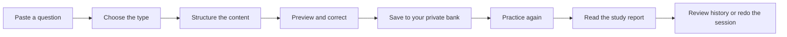
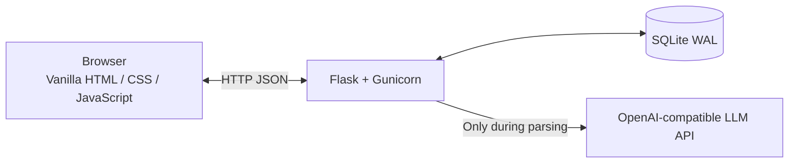

<div align="center">

# TOEFL Review

**Turn scattered TOEFL mistakes into a private question bank you can actually practice, revisit, and review.**

A lightweight, open-source, self-hosted TOEFL mistake-review system.  
It supports structured imports, exam-style practice, instant grading, study reports, and practice history.

**English** · [简体中文](./README_ZH.md) · [日本語](./README_JA.md) · [한국어](./README_KO.md)

[](./LICENSE)
[](https://www.python.org/)
[](https://flask.palletsprojects.com/)
[](./docker-compose.yml)
[](https://www.sqlite.org/)

</div>

---

## What does TOEFL Review do?

Mistakes often end up as screenshots, chat messages, Word files, or notes scattered across different apps.

They may be “saved,” but they are rarely practiced again.

TOEFL Review provides a complete review workflow:



It is not merely a place to store questions. It is a personal practice system designed for long-term accumulation and repeated review.

---

## Main features

### Structured question import

Each question type has its own input form, so you do not need to force every field into one large text box.

Currently supported:

| Question type | Import fields |
| --- | --- |
| Reading multiple choice | Title, passage, question, A–D options, correct answer, explanation |
| Build a Sentence | Prompt, sentence template, word bank, correct order, complete sentence, explanation |
| Complete the Words | Passage with underscore blanks, answer list, explanation |

Reading multiple-choice questions and some Build a Sentence questions can be organized through any LLM endpoint compatible with the OpenAI Chat Completions protocol.

Complete the Words questions are primarily parsed locally from underscore positions in the original passage. This reduces the risk of an LLM rewriting the passage or inventing new blanks.

Parsed content is not saved immediately. You can review and edit every structured field before adding the question to your bank.

### Private question library

Every saved question is stored in the local question library.

You can:

- Filter by question type;
- Search prompts, passages, and other content;
- Sort by creation time, error rate, or most recent practice;
- View attempts, correct answers, and incorrect answers for each question;
- Practice, edit, or delete an individual question;
- Spot questions with a high repeated-error rate;
- Select specific questions and combine them into a practice session.

Deleting a question also deletes the attempt records associated with that question.

### Practice interfaces designed for each question type

Each question type uses a dedicated interaction model instead of a generic text field.

#### Reading multiple choice

The passage and question are displayed in separate areas. Select A, B, C, or D directly.

#### Build a Sentence

Fixed text stays in its original position. Word-bank chunks can be clicked or dragged into the matching blanks.

#### Complete the Words

Letter cells appear directly where letters are missing in the passage, with one cell for each missing letter.

After every submission, the app immediately shows:

- Whether the answer is correct;
- Your answer;
- The correct answer;
- Per-option or per-blank feedback;
- The explanation;
- Cumulative statistics for that question.

### Choose the questions for each session

You can start with a preset number of questions or enter a custom amount.

You can also open the library, manually select specific questions, and create a focused practice session.

During practice, you can move backward and forward, retry the current question, or exit early.

### Complete study reports

At the end of a session, TOEFL Review generates a full study report instead of showing only an accuracy percentage.

The report includes:

- Total questions;
- Correct answers;
- Incorrect answers;
- Accuracy;
- Filters for all, correct, and incorrect questions;
- The original content of each question;
- Your answer and the correct answer;
- Per-option or per-blank results;
- The explanation.

You can switch between questions in the report and quickly locate every mistake from the session.

### Practice history

Each completed practice session is saved automatically.

The history page shows:

- Practice time;
- Number of questions;
- Correct and incorrect totals;
- Session accuracy.

Open any historical session to view its full report again, or redo the entire session with the same questions.

### Bring your own LLM

TOEFL Review is not tied to a particular model or provider.

The Settings page accepts:

- API Key;
- Base URL or full request URL;
- Model name;
- Optional custom JSON parameters.

Providers that implement the OpenAI Chat Completions request format will generally work.

A built-in connection test lets you verify the URL, model, and API Key before importing questions.

> The project does not include an LLM service or usage quota. Pricing, rate limits, and data-processing policies are determined by your chosen provider.

### Local storage and optional login protection

Questions, attempts, practice reports, and settings are stored in a local SQLite database:

```text
data/toefl_review.sqlite3
```

The LLM API Key is encrypted with Fernet using a key derived from `APP_SECRET`. It is never displayed back in plaintext on the Settings page.

You can also enable access authentication in Settings. Once enabled, the instance requires a shared username and password.

Important limitations:

- This protects one personal instance; it is not a multi-user account system;
- The built-in login does not replace HTTPS;
- Public deployments should still use a reverse proxy such as Caddy or Nginx with HTTPS enabled.

> The current web interface is primarily written in Simplified Chinese. The documentation is multilingual, but the application UI has not yet been fully internationalized.

---

## Quick start

### Deploy with Docker Compose

This is the simplest and recommended way to run the project.

#### 1. Install the prerequisites

You need:

- Git
- Docker
- Docker Compose

Current Docker Desktop releases and most modern Linux Docker installations already include the `docker compose` command.

#### 2. Download the project

```bash
git clone https://github.com/Kairitsu/toefl-review.git
cd toefl-review
```

#### 3. Create the configuration file

```bash
mkdir -p secrets data
cp secrets/app.env.example secrets/app.env
```

Generate a random secret:

```bash
openssl rand -hex 32
```

Open `secrets/app.env` and place the generated value after the equals sign:

```env
APP_SECRET=replace-this-with-the-generated-random-value
```

`APP_SECRET` protects the stored API Key and login sessions.

Once the project contains data, keep this value stable. Changing `APP_SECRET` prevents the app from decrypting an API Key already stored in the database.

#### 4. Start the service

```bash
docker compose up -d --build
```

Check the status:

```bash
docker compose ps
```

View logs:

```bash
docker compose logs -f app
```

#### 5. Open the web app

When running on your current computer, open:

```text
http://127.0.0.1:3219
```

Stop the service with:

```bash
docker compose down
```

---

## Deploying on a server

Docker Compose binds the service to the server's local interface by default:

```text
127.0.0.1:3219
```

This prevents the application port from being exposed directly to the public internet.

For a VPS or cloud server, use Caddy or Nginx to reverse proxy your domain to:

```text
http://127.0.0.1:3219
```

Enable HTTPS for the domain.

For temporary access, create an SSH tunnel from your own computer:

```bash
ssh -L 3219:127.0.0.1:3219 username@server-address
```

Then open this address locally:

```text
http://127.0.0.1:3219
```

---

## First-time setup

A practical first-run sequence is:

1. Open Settings;
2. Enter the LLM API Key, Base URL, and model name;
3. Run the connection test;
4. Optionally configure an access username and password;
5. Open Import and choose the question type;
6. Enter or paste the question, answer, and explanation;
7. Parse the content and review the preview;
8. Save the question to the library;
9. Open Practice and begin reviewing.

---

## Updating the project

Back up the database before updating:

```bash
./scripts/backup-db.sh
```

Then pull the latest code and rebuild:

```bash
git pull
docker compose up -d --build
```

Check the updated service:

```bash
docker compose ps
docker compose logs --tail=100 app
```

---

## Backup and restore

### Backup script

Run this command from the project root:

```bash
./scripts/backup-db.sh
```

Backups are written to:

```text
data/backups/
```

### Manual backup

You can also stop the containers and copy the entire `data` directory:

```bash
docker compose down
cp -a data data-backup
docker compose up -d
```

### Restore

Stop the service and restore the database file to:

```text
data/toefl_review.sqlite3
```

Then start the service again:

```bash
docker compose up -d
```

When restoring an existing database, continue using its original `APP_SECRET`, or the previously stored API Key cannot be decrypted.

---

## Running without Docker

The project can also run directly with Python.

```bash
git clone https://github.com/Kairitsu/toefl-review.git
cd toefl-review

python -m venv .venv
source .venv/bin/activate

pip install -r requirements.txt

export APP_SECRET="$(openssl rand -hex 32)"
export DATA_DIR="data"

flask --app app run --host 127.0.0.1 --port 8000
```

On Windows PowerShell, activate the virtual environment with:

```powershell
.\.venv\Scripts\Activate.ps1
```

Then open:

```text
http://127.0.0.1:8000
```

For long-running deployments, use the included Docker configuration or Gunicorn rather than Flask's development server.

---

## Data and privacy

The default data flow is:

- Questions and practice records stay in your SQLite database;
- The API Key is encrypted before being stored;
- The browser does not display the complete saved API Key again;
- Question content is sent to an LLM provider only when you explicitly run LLM parsing;
- The project does not automatically synchronize your question bank to a third-party cloud service.

Never commit the following files or values:

```text
data/
secrets/app.env
API keys
Database files
Real login credentials
```

---

## Scope and limitations

The current version is designed primarily for personal self-hosting.

It is suitable for:

- Organizing your own TOEFL mistakes;
- Practicing repeatedly in desktop or mobile browsers;
- Using your own LLM API to help structure questions;
- Keeping and controlling data on your own server.

It is not:

- A multi-user online learning platform;
- A TOEFL question downloading or scraping tool;
- A commercial service with included LLM credits;
- An official ETS product.

---

<details>
<summary><strong>Technical architecture</strong></summary>



| Component | Technology |
| --- | --- |
| Backend | Python 3.12, Flask, Gunicorn |
| Frontend | Vanilla HTML, CSS, JavaScript |
| Database | SQLite in WAL mode |
| API Key encryption | `cryptography` Fernet |
| Login password | PBKDF2-SHA256 hash |
| Deployment | Docker Compose |
| Default binding | `127.0.0.1:3219` |

The frontend has no Node.js dependency and requires no bundling or build step.

</details>

<details>
<summary><strong>Project structure</strong></summary>

```text
toefl-review/
├── app.py
├── static/
│   ├── index.html
│   ├── app.js
│   └── styles.css
├── scripts/
│   └── backup-db.sh
├── secrets/
│   └── app.env.example
├── docker-compose.yml
├── Dockerfile
├── requirements.txt
├── LICENSE
├── README.md
├── README_ZH.md
├── README_JA.md
└── README_KO.md
```

</details>

---

## Frequently asked questions

### Is an LLM API required?

The question library, practice system, study reports, and practice history do not depend on an LLM.

Complete the Words questions are primarily parsed with local rules. Well-structured Build a Sentence input can also use local structured parsing.

Automatic organization of Reading multiple-choice questions and other unstructured content generally requires an OpenAI Chat Completions-compatible LLM endpoint.

### Is my data uploaded to the project author's server?

No.

The project has no central server operated by the author. Data is stored in the SQLite database on the machine where you deploy it.

However, when you run LLM parsing, the pasted question content is sent to the LLM provider you configured.

### Can I use it on a phone?

Yes.

The interface includes responsive layouts for narrow screens. A phone can use the app through a browser as long as it can reach the deployment address.

### Can multiple people register accounts?

No.

The current authentication feature configures one shared credential for the entire personal instance. It does not provide registration, user isolation, or separate question banks.

---

## Contributing

Issues and improvement proposals are welcome.

When submitting code, please describe:

- What problem the change solves;
- Whether it changes the existing data structure;
- Whether it affects Docker deployment;
- Whether basic desktop and mobile testing was completed.

---

## License

This project is licensed under the [GNU Affero General Public License v3.0](./LICENSE).

You may use, study, and modify the project. If you distribute a modified version or provide it to others as a network service, you must comply with the AGPL-3.0 source-code disclosure requirements.

---

<div align="center">

**Do not let a mistake remain merely “saved.” Practice it again.**

</div>
