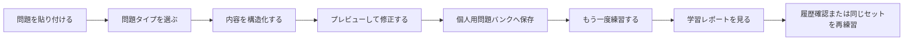
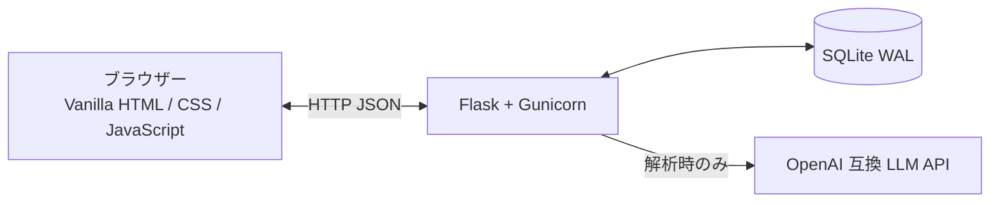

<div align="center">

# TOEFL Review

**散らばった TOEFL の間違いを、繰り返し解き直し・確認・復習できる自分専用の問題バンクへ。**

軽量・オープンソース・セルフホスト型の TOEFL 間違い復習システムです。  
問題の構造化取り込み、試験形式の練習、即時採点、学習レポート、練習履歴に対応します。

[English](./README.md) · [简体中文](./README_ZH.md) · **日本語** · [한국어](./README_KO.md)

[](./LICENSE)
[](https://www.python.org/)
[](https://flask.palletsprojects.com/)
[](./docker-compose.yml)
[](https://www.sqlite.org/)

</div>

---

## TOEFL Review でできること

間違えた問題は、スクリーンショット、チャット、Word 文書、さまざまなメモの中に散らばりがちです。

「保存」はされても、実際にもう一度解かれることはあまりありません。

TOEFL Review は、次の一連の復習フローを提供します。



単に問題を保管するノートではなく、長期的に蓄積しながら繰り返し使うための個人用練習システムです。

---

## 主な機能

### 構造化された問題取り込み

問題タイプごとに専用の入力フォームがあるため、すべての内容を一つの大きなテキスト欄へ詰め込む必要はありません。

現在対応している形式：

| 問題タイプ | 取り込み項目 |
| --- | --- |
| 読解選択問題 | タイトル、本文、設問、A〜D の選択肢、正解、解説 |
| Build a Sentence | プロンプト、文テンプレート、語句バンク、正しい順序、完成文、解説 |
| Complete the Words | 下線で空欄を示した本文、解答一覧、解説 |

読解選択問題と一部の Build a Sentence 問題は、OpenAI Chat Completions 互換の LLM エンドポイントを使って整理できます。

Complete the Words は、元の本文にある下線位置を基準にローカルで解析します。これにより、LLM が本文を書き換えたり、存在しない空欄を追加したりするリスクを抑えます。

解析結果はすぐには保存されません。構造化された各項目を確認・修正してから問題バンクへ追加できます。

### 個人用問題ライブラリ

保存した問題はすべてローカルの問題ライブラリへ入ります。

次の操作ができます。

- 問題タイプで絞り込む；
- 設問、本文などを検索する；
- 作成日時、誤答率、最終練習日時で並べ替える；
- 各問題の練習回数、正解数、不正解数を見る；
- 問題を個別に練習・編集・削除する；
- 繰り返し誤答率が高い問題を見つける；
- ライブラリから任意の問題を選び、一回分の練習セットを作る。

問題を削除すると、その問題に関連する解答履歴も削除されます。

### 問題タイプに合わせた練習画面

すべてを同じ入力欄で解かせるのではなく、問題タイプごとに専用の操作方法を用意しています。

#### 読解選択問題

本文と設問を分けて表示し、A・B・C・D を直接選択します。

#### Build a Sentence

固定テキストは文中の位置に残り、語句バンクの項目をクリックまたはドラッグして空欄へ入れられます。

#### Complete the Words

本文中の文字が欠けている位置に、欠落文字数に応じた一文字ずつの入力欄が表示されます。

提出後はすぐに次の内容が表示されます。

- 正解か不正解か；
- 自分の解答；
- 正しい解答；
- 選択肢または空欄ごとの判定；
- 問題の解説；
- その問題の累計練習統計。

### 練習する問題を自由に選択

練習開始時に、用意された問題数を選ぶか、任意の問題数を入力できます。

問題ライブラリから練習したい問題を手動で選び、特定の問題だけを集めた練習セットを作ることもできます。

練習中は前の問題・次の問題への移動、現在の問題の再挑戦、途中終了に対応します。

### 詳細な学習レポート

一回分の練習が終わると、正答率だけではなく、詳細な学習レポートが生成されます。

レポートには次の内容が含まれます。

- 総問題数；
- 正解数；
- 不正解数；
- 正答率；
- すべて・正解・不正解のフィルター；
- 各問題の原文；
- 自分の解答と正解；
- 選択肢または空欄ごとの結果；
- 問題の解説。

レポート内で問題を切り替えながら、どこで間違えたかをすばやく確認できます。

### 練習履歴

一回分の練習を完了すると、その結果は自動的に保存されます。

履歴画面には次の内容が表示されます。

- 練習日時；
- 問題数；
- 正解数と不正解数；
- その回の正答率。

過去の履歴を開くと、当時の学習レポートをもう一度確認できます。同じ問題セットをそのまま再練習することもできます。

### 自分の LLM を利用

TOEFL Review は特定のモデルやサービス提供者に固定されていません。

設定画面では次を入力できます。

- API Key；
- Base URL または完全なリクエスト URL；
- モデル名；
- 任意のカスタム JSON パラメータ。

OpenAI Chat Completions のリクエスト形式に対応するサービスであれば、通常は接続できます。

接続テスト機能により、問題を取り込む前に URL・モデル・API Key を確認できます。

> このプロジェクトには LLM サービスや利用枠は含まれません。料金、レート制限、データ処理方針は利用するサービス提供者によって決まります。

### ローカル保存と任意のログイン保護

問題、解答履歴、学習レポート、設定はローカルの SQLite データベースへ保存されます。

```text
data/toefl_review.sqlite3
```

LLM の API Key は、`APP_SECRET` から導出した Fernet キーで暗号化して保存されます。設定画面で平文として再表示されることはありません。

設定画面からアクセス認証を有効にすることもできます。有効化後は、共通のユーザー名とパスワードが必要になります。

注意点：

- これは個人用インスタンス全体を保護する機能であり、複数ユーザーのアカウントシステムではありません；
- 内蔵ログインは HTTPS の代わりにはなりません；
- インターネットへ公開する場合は、Caddy や Nginx などのリバースプロキシを使い、HTTPS を設定してください。

> 現在の Web UI は主に簡体字中国語です。ドキュメントは多言語ですが、アプリ本体の UI はまだ完全には国際化されていません。

---

## クイックスタート

### Docker Compose でデプロイ

最も簡単で推奨される方法です。

#### 1. 必要な環境を準備

次をインストールしてください。

- Git
- Docker
- Docker Compose

現在の Docker Desktop と多くの Linux 向け Docker 環境には、通常 `docker compose` コマンドが含まれています。

#### 2. プロジェクトを取得

```bash
git clone https://github.com/Kairitsu/toefl-review.git
cd toefl-review
```

#### 3. 設定ファイルを作成

```bash
mkdir -p secrets data
cp secrets/app.env.example secrets/app.env
```

ランダムな秘密値を生成します。

```bash
openssl rand -hex 32
```

`secrets/app.env` を開き、生成した値を等号の後へ入力します。

```env
APP_SECRET=生成したランダムな値に置き換える
```

`APP_SECRET` は API Key とログインセッションの保護に使われます。

データが作成された後は、この値を変更しないでください。変更すると、データベースに保存済みの API Key を復号できなくなります。

#### 4. サービスを起動

```bash
docker compose up -d --build
```

状態を確認：

```bash
docker compose ps
```

ログを確認：

```bash
docker compose logs -f app
```

#### 5. Web アプリを開く

現在のコンピューターで実行している場合：

```text
http://127.0.0.1:3219
```

停止する場合：

```bash
docker compose down
```

---

## サーバーへデプロイする場合

Docker Compose は既定で、サーバーのローカルインターフェースだけにバインドします。

```text
127.0.0.1:3219
```

これにより、アプリのポートがそのままインターネットへ公開されることを防ぎます。

VPS やクラウドサーバーでは、Caddy または Nginx を使い、ドメインを次へリバースプロキシしてください。

```text
http://127.0.0.1:3219
```

ドメインには HTTPS を設定してください。

一時的にアクセスするだけなら、自分のコンピューターから SSH トンネルを作成できます。

```bash
ssh -L 3219:127.0.0.1:3219 username@server-address
```

その後、ローカルのブラウザーで開きます。

```text
http://127.0.0.1:3219
```

---

## 初回利用の流れ

起動後は次の順序がおすすめです。

1. 設定画面を開く；
2. LLM の API Key、Base URL、モデル名を入力する；
3. 接続テストを実行する；
4. 必要に応じてアクセス用のユーザー名とパスワードを設定する；
5. 取り込み画面で問題タイプを選ぶ；
6. 問題、解答、解説を入力または貼り付ける；
7. 解析結果をプレビューして確認する；
8. 問題ライブラリへ保存する；
9. 練習画面を開いて復習を始める。

---

## プロジェクトの更新

更新前にデータベースをバックアップしてください。

```bash
./scripts/backup-db.sh
```

最新コードを取得して再ビルドします。

```bash
git pull
docker compose up -d --build
```

更新後の状態を確認：

```bash
docker compose ps
docker compose logs --tail=100 app
```

---

## バックアップと復元

### バックアップスクリプト

プロジェクトのルートで実行します。

```bash
./scripts/backup-db.sh
```

バックアップは次へ保存されます。

```text
data/backups/
```

### 手動バックアップ

コンテナを停止して `data` ディレクトリ全体をコピーすることもできます。

```bash
docker compose down
cp -a data data-backup
docker compose up -d
```

### 復元

サービスを停止し、バックアップしたデータベースを次の場所へ戻します。

```text
data/toefl_review.sqlite3
```

その後、再び起動します。

```bash
docker compose up -d
```

既存データベースを復元するときは、以前と同じ `APP_SECRET` を使ってください。異なる値では、保存済み API Key を復号できません。

---

## Docker を使わずに実行

Python から直接起動することもできます。

```bash
git clone https://github.com/Kairitsu/toefl-review.git
cd toefl-review

python -m venv .venv
source .venv/bin/activate

pip install -r requirements.txt

export APP_SECRET="$(openssl rand -hex 32)"
export DATA_DIR="data"

flask --app app run --host 127.0.0.1 --port 8000
```

Windows PowerShell で仮想環境を有効化する場合：

```powershell
.\.venv\Scripts\Activate.ps1
```

起動後：

```text
http://127.0.0.1:8000
```

長期間稼働させる場合は、Flask の開発サーバーではなく、同梱の Docker 構成または Gunicorn を推奨します。

---

## データとプライバシー

既定のデータフローは次のとおりです。

- 問題と練習履歴は自分の SQLite データベースに保存される；
- API Key は暗号化して保存される；
- 保存済み API Key の全体はブラウザーへ再表示されない；
- LLM 解析を明示的に実行した場合だけ、問題内容が設定した LLM 提供者へ送られる；
- プロジェクトが問題バンクを第三者のクラウドへ自動同期することはない。

次の内容を Git リポジトリへコミットしないでください。

```text
data/
secrets/app.env
API Key
データベースファイル
実際のログイン情報
```

---

## 対象範囲と制限

現在のバージョンは、主に個人のセルフホスト利用を想定しています。

適している用途：

- 自分の TOEFL 間違い問題を整理する；
- PC またはスマートフォンのブラウザーで繰り返し練習する；
- 自分の LLM API を使って問題整理を補助する；
- 自分のサーバー上でデータを保管・管理する。

次のものではありません：

- 複数ユーザー向けオンライン学習プラットフォーム；
- TOEFL 問題のダウンロードまたは収集ツール；
- LLM 利用枠を含む商用サービス；
- ETS の公式製品。

---

<details>
<summary><strong>技術構成</strong></summary>



| 項目 | 技術 |
| --- | --- |
| バックエンド | Python 3.12、Flask、Gunicorn |
| フロントエンド | Vanilla HTML、CSS、JavaScript |
| データベース | SQLite、WAL モード |
| API Key 暗号化 | `cryptography` Fernet |
| ログインパスワード | PBKDF2-SHA256 ハッシュ |
| デプロイ | Docker Compose |
| 既定のバインド | `127.0.0.1:3219` |

フロントエンドに Node.js 依存はなく、バンドルやビルド作業も不要です。

</details>

<details>
<summary><strong>プロジェクト構成</strong></summary>

```text
toefl-review/
├── app.py
├── static/
│   ├── index.html
│   ├── app.js
│   └── styles.css
├── scripts/
│   └── backup-db.sh
├── secrets/
│   └── app.env.example
├── docker-compose.yml
├── Dockerfile
├── requirements.txt
├── LICENSE
├── README.md
├── README_ZH.md
├── README_JA.md
└── README_KO.md
```

</details>

---

## よくある質問

### LLM API は必須ですか？

問題ライブラリ、練習、学習レポート、練習履歴は LLM に依存しません。

Complete the Words は主にローカルルールで解析されます。形式が整った Build a Sentence の入力もローカル構造化解析を優先できます。

読解選択問題など、構造化されていない内容の自動整理には、通常 OpenAI Chat Completions 互換の LLM エンドポイントが必要です。

### データはプロジェクト作者のサーバーへ送られますか？

送られません。

作者が運営する中央サーバーはありません。データはデプロイ先の SQLite データベースに保存されます。

ただし、LLM 解析を実行した場合、貼り付けた問題内容は自分で設定した LLM 提供者へ送られます。

### スマートフォンでも使えますか？

使えます。

狭い画面向けのレスポンシブ表示に対応しています。スマートフォンからデプロイ先へ接続できれば、ブラウザーで利用できます。

### 複数人がアカウント登録できますか？

できません。

現在の認証機能は、個人用インスタンス全体に一組の共通認証情報を設定するものです。ユーザー登録、ユーザー分離、個別の問題バンクには対応していません。

---

## コントリビューション

不具合報告や改善提案は Issue で受け付けています。

コードを提出する場合は、次の点を記載してください。

- どの問題を解決する変更か；
- 既存のデータ構造を変更するか；
- Docker デプロイへ影響するか；
- PC とスマートフォンで基本的なテストを行ったか。

---

## ライセンス

このプロジェクトは [GNU Affero General Public License v3.0](./LICENSE) で公開されています。

利用、研究、改変が可能です。改変版を配布する場合、またはネットワークサービスとして他者へ提供する場合は、AGPL-3.0 のソースコード公開要件に従う必要があります。

---

<div align="center">

**間違いを「保存しただけ」で終わらせず、もう一度解いてください。**

</div>
