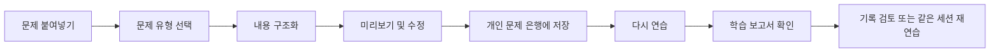
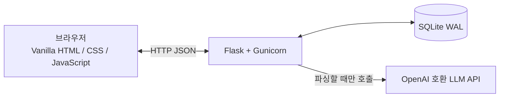

<div align="center">

# TOEFL Review

**흩어진 TOEFL 오답을 실제로 반복 연습하고, 다시 보고, 복습할 수 있는 개인 문제 은행으로 바꾸세요.**

가볍고 오픈 소스이며 직접 호스팅할 수 있는 TOEFL 오답 복습 시스템입니다.  
문제 구조화 가져오기, 시험형 연습, 즉시 채점, 학습 보고서, 연습 기록을 지원합니다.

[English](./README.md) · [简体中文](./README_ZH.md) · [日本語](./README_JA.md) · **한국어**

[](./LICENSE)
[](https://www.python.org/)
[](https://flask.palletsprojects.com/)
[](./docker-compose.yml)
[](https://www.sqlite.org/)

</div>

---

## TOEFL Review는 무엇을 하나요?

오답은 흔히 스크린샷, 채팅 기록, Word 문서, 여러 앱의 메모 속에 흩어집니다.

“저장”은 되어 있어도 실제로 다시 풀어보는 경우는 많지 않습니다.

TOEFL Review는 다음과 같은 완전한 복습 흐름을 제공합니다.



단순히 문제를 보관하는 전자 노트가 아니라, 장기간 문제를 쌓고 반복해서 사용할 수 있는 개인 연습 시스템입니다.

---

## 주요 기능

### 구조화된 문제 가져오기

문제 유형별 전용 입력 양식을 제공하므로 모든 내용을 하나의 큰 텍스트 상자에 억지로 넣을 필요가 없습니다.

현재 지원하는 유형:

| 문제 유형 | 가져오기 항목 |
| --- | --- |
| 독해 객관식 | 제목, 지문, 질문, A–D 선택지, 정답, 해설 |
| Build a Sentence | 질문, 문장 템플릿, 단어 은행, 올바른 순서, 완성 문장, 해설 |
| Complete the Words | 밑줄 빈칸이 있는 지문, 정답 목록, 해설 |

독해 객관식과 일부 Build a Sentence 문제는 OpenAI Chat Completions 프로토콜과 호환되는 LLM 엔드포인트를 사용해 정리할 수 있습니다.

Complete the Words 문제는 원문에 있는 밑줄 위치를 기준으로 로컬에서 우선 파싱합니다. 이를 통해 LLM이 지문을 임의로 수정하거나 존재하지 않는 빈칸을 추가할 위험을 줄입니다.

파싱 결과는 즉시 저장되지 않습니다. 구조화된 각 항목을 확인하고 수정한 뒤 문제 은행에 추가할 수 있습니다.

### 개인 문제 라이브러리

저장한 모든 문제는 로컬 문제 라이브러리에 들어갑니다.

다음 작업을 할 수 있습니다.

- 문제 유형으로 필터링;
- 질문, 지문 등 검색;
- 생성 시각, 오답률, 최근 연습 시각으로 정렬;
- 문제별 연습 횟수, 정답 수, 오답 수 확인;
- 개별 문제 연습, 편집, 삭제;
- 반복 오답률이 높은 문제 확인;
- 라이브러리에서 원하는 문제를 선택해 한 번의 연습 세션 구성.

문제를 삭제하면 해당 문제와 연결된 답안 기록도 함께 삭제됩니다.

### 문제 유형에 맞춘 연습 화면

모든 문제를 같은 입력 상자로 처리하지 않고, 문제 유형마다 전용 상호작용 방식을 제공합니다.

#### 독해 객관식

지문과 질문을 분리해서 표시하며 A, B, C, D를 직접 선택합니다.

#### Build a Sentence

고정 문구는 문장 안의 원래 위치에 남아 있고, 단어 은행의 어구를 클릭하거나 드래그해 해당 빈칸에 넣을 수 있습니다.

#### Complete the Words

지문에서 글자가 빠진 위치에 입력 칸이 직접 표시되며, 빠진 글자 수만큼 한 글자씩 입력할 수 있습니다.

답안을 제출하면 즉시 다음 내용을 확인할 수 있습니다.

- 정답 여부;
- 내가 제출한 답;
- 정답;
- 선택지 또는 빈칸별 판정;
- 문제 해설;
- 해당 문제의 누적 연습 통계.

### 세션별 문제를 자유롭게 선택

연습 시작 시 미리 정해진 문제 수를 선택하거나 원하는 문제 수를 직접 입력할 수 있습니다.

문제 라이브러리에서 연습할 문제를 직접 선택해 특정 문제만 모은 집중 연습 세션을 만들 수도 있습니다.

연습 중에는 이전 문제와 다음 문제로 이동하고, 현재 문제를 다시 풀거나, 중간에 종료할 수 있습니다.

### 상세한 학습 보고서

한 번의 연습이 끝나면 정확도 숫자 하나만 보여주는 대신 완전한 학습 보고서를 생성합니다.

보고서에는 다음 내용이 포함됩니다.

- 전체 문제 수;
- 정답 수;
- 오답 수;
- 정답률;
- 전체, 정답, 오답 필터;
- 각 문제의 원문;
- 내 답과 정답;
- 선택지 또는 빈칸별 결과;
- 문제 해설.

보고서 안에서 문제를 전환하며 어느 부분에서 틀렸는지 빠르게 확인할 수 있습니다.

### 연습 기록

한 번의 연습을 완료하면 결과가 자동으로 저장됩니다.

연습 기록 화면에는 다음 정보가 표시됩니다.

- 연습 시각;
- 문제 수;
- 정답 수와 오답 수;
- 해당 세션의 정답률.

과거 기록을 열어 당시의 전체 학습 보고서를 다시 확인할 수 있으며, 같은 문제 세트를 그대로 다시 연습할 수도 있습니다.

### 내 LLM 사용

TOEFL Review는 특정 모델이나 제공업체에 종속되지 않습니다.

설정 화면에서 다음 항목을 입력할 수 있습니다.

- API Key;
- Base URL 또는 전체 요청 URL;
- 모델 이름;
- 선택적 사용자 지정 JSON 매개변수.

OpenAI Chat Completions 요청 형식을 구현한 서비스라면 일반적으로 연결할 수 있습니다.

내장된 연결 테스트를 통해 문제를 가져오기 전에 URL, 모델, API Key가 올바른지 확인할 수 있습니다.

> 이 프로젝트에는 LLM 서비스나 사용량이 포함되어 있지 않습니다. 비용, 속도 제한, 데이터 처리 정책은 선택한 제공업체에 따라 달라집니다.

### 로컬 저장 및 선택적 로그인 보호

문제, 답안 기록, 학습 보고서, 설정은 로컬 SQLite 데이터베이스에 저장됩니다.

```text
data/toefl_review.sqlite3
```

LLM API Key는 `APP_SECRET`에서 파생된 키를 사용해 Fernet으로 암호화한 뒤 저장됩니다. 설정 화면에 평문으로 다시 표시되지 않습니다.

설정 화면에서 접근 인증을 활성화할 수도 있습니다. 활성화하면 인스턴스에 접속할 때 공용 사용자 이름과 비밀번호가 필요합니다.

주의 사항:

- 개인 인스턴스 전체를 보호하는 기능이며 다중 사용자 계정 시스템이 아닙니다;
- 내장 로그인은 HTTPS를 대체하지 않습니다;
- 인터넷에 공개할 경우 Caddy 또는 Nginx 같은 리버스 프록시를 사용하고 HTTPS를 설정해야 합니다.

> 현재 웹 인터페이스는 주로 중국어 간체로 작성되어 있습니다. 문서는 여러 언어로 제공되지만 애플리케이션 UI는 아직 완전히 국제화되지 않았습니다.

---

## 빠른 시작

### Docker Compose로 배포

가장 간단하고 권장되는 실행 방식입니다.

#### 1. 필요한 환경 설치

다음이 필요합니다.

- Git
- Docker
- Docker Compose

현재 Docker Desktop과 대부분의 최신 Linux Docker 설치에는 일반적으로 `docker compose` 명령이 포함되어 있습니다.

#### 2. 프로젝트 다운로드

```bash
git clone https://github.com/Kairitsu/toefl-review.git
cd toefl-review
```

#### 3. 설정 파일 생성

```bash
mkdir -p secrets data
cp secrets/app.env.example secrets/app.env
```

무작위 비밀값을 생성합니다.

```bash
openssl rand -hex 32
```

`secrets/app.env`를 열고 생성한 값을 등호 뒤에 입력합니다.

```env
APP_SECRET=생성한-무작위-값으로-교체
```

`APP_SECRET`은 API Key와 로그인 세션을 보호합니다.

프로젝트에 데이터가 생성된 뒤에는 이 값을 유지해야 합니다. 값을 변경하면 데이터베이스에 이미 저장된 API Key를 복호화할 수 없습니다.

#### 4. 서비스 시작

```bash
docker compose up -d --build
```

상태 확인:

```bash
docker compose ps
```

로그 확인:

```bash
docker compose logs -f app
```

#### 5. 웹 앱 열기

현재 컴퓨터에서 실행 중이라면 다음 주소를 엽니다.

```text
http://127.0.0.1:3219
```

서비스 중지:

```bash
docker compose down
```

---

## 서버에 배포하기

Docker Compose는 기본적으로 서버의 로컬 인터페이스에만 바인딩합니다.

```text
127.0.0.1:3219
```

따라서 애플리케이션 포트가 인터넷에 직접 노출되지 않습니다.

VPS 또는 클라우드 서버에서는 Caddy나 Nginx를 사용해 도메인을 다음 주소로 리버스 프록시하는 것을 권장합니다.

```text
http://127.0.0.1:3219
```

도메인에는 HTTPS를 활성화하세요.

임시로 접속하려면 내 컴퓨터에서 SSH 터널을 만들 수 있습니다.

```bash
ssh -L 3219:127.0.0.1:3219 username@server-address
```

그다음 로컬 브라우저에서 다음 주소를 엽니다.

```text
http://127.0.0.1:3219
```

---

## 첫 사용 순서

실행 후 다음 순서로 설정하는 것을 권장합니다.

1. 설정 화면 열기;
2. LLM API Key, Base URL, 모델 이름 입력;
3. 연결 테스트 실행;
4. 필요하면 접근용 사용자 이름과 비밀번호 설정;
5. 가져오기 화면에서 문제 유형 선택;
6. 문제, 정답, 해설 입력 또는 붙여넣기;
7. 파싱 결과 미리보기 및 확인;
8. 문제 라이브러리에 저장;
9. 연습 화면에서 복습 시작.

---

## 프로젝트 업데이트

업데이트 전에 데이터베이스를 백업하는 것을 권장합니다.

```bash
./scripts/backup-db.sh
```

최신 코드를 가져오고 다시 빌드합니다.

```bash
git pull
docker compose up -d --build
```

업데이트된 상태 확인:

```bash
docker compose ps
docker compose logs --tail=100 app
```

---

## 백업 및 복원

### 백업 스크립트

프로젝트 루트에서 실행합니다.

```bash
./scripts/backup-db.sh
```

백업 파일은 다음 위치에 저장됩니다.

```text
data/backups/
```

### 수동 백업

컨테이너를 중지한 뒤 `data` 디렉터리 전체를 복사할 수도 있습니다.

```bash
docker compose down
cp -a data data-backup
docker compose up -d
```

### 복원

서비스를 중지하고 백업한 데이터베이스 파일을 다음 위치로 복원합니다.

```text
data/toefl_review.sqlite3
```

그다음 다시 시작합니다.

```bash
docker compose up -d
```

기존 데이터베이스를 복원할 때는 이전과 동일한 `APP_SECRET`을 사용해야 합니다. 다른 값을 사용하면 저장된 API Key를 복호화할 수 없습니다.

---

## Docker 없이 실행

Python으로 직접 실행할 수도 있습니다.

```bash
git clone https://github.com/Kairitsu/toefl-review.git
cd toefl-review

python -m venv .venv
source .venv/bin/activate

pip install -r requirements.txt

export APP_SECRET="$(openssl rand -hex 32)"
export DATA_DIR="data"

flask --app app run --host 127.0.0.1 --port 8000
```

Windows PowerShell에서 가상 환경을 활성화하려면:

```powershell
.\.venv\Scripts\Activate.ps1
```

실행 후 접속:

```text
http://127.0.0.1:8000
```

장기간 실행할 때는 Flask 개발 서버보다 포함된 Docker 구성 또는 Gunicorn을 사용하는 것이 좋습니다.

---

## 데이터와 개인정보 보호

기본 데이터 흐름은 다음과 같습니다.

- 문제와 연습 기록은 내 SQLite 데이터베이스에 저장됩니다;
- API Key는 암호화된 뒤 저장됩니다;
- 브라우저는 저장된 전체 API Key를 다시 표시하지 않습니다;
- LLM 파싱을 직접 실행할 때만 문제 내용이 설정한 LLM 제공업체로 전송됩니다;
- 프로젝트가 문제 은행을 제3자 클라우드에 자동으로 동기화하지 않습니다.

다음 내용은 Git 저장소에 커밋하지 마세요.

```text
data/
secrets/app.env
API Key
데이터베이스 파일
실제 로그인 자격 증명
```

---

## 프로젝트 범위와 제한

현재 버전은 주로 개인 셀프호스팅을 위해 설계되었습니다.

적합한 용도:

- 내 TOEFL 오답 정리;
- 데스크톱 또는 모바일 브라우저에서 반복 연습;
- 내 LLM API를 이용한 문제 구조화 보조;
- 내 서버에서 데이터 저장 및 관리.

다음과 같은 제품은 아닙니다.

- 다중 사용자 온라인 학습 플랫폼;
- TOEFL 문제 다운로드 또는 수집 도구;
- LLM 사용량이 포함된 상용 서비스;
- ETS 공식 제품.

---

<details>
<summary><strong>기술 구조</strong></summary>



| 구성 요소 | 기술 |
| --- | --- |
| 백엔드 | Python 3.12, Flask, Gunicorn |
| 프론트엔드 | Vanilla HTML, CSS, JavaScript |
| 데이터베이스 | SQLite WAL 모드 |
| API Key 암호화 | `cryptography` Fernet |
| 로그인 비밀번호 | PBKDF2-SHA256 해시 |
| 배포 | Docker Compose |
| 기본 바인딩 | `127.0.0.1:3219` |

프론트엔드는 Node.js에 의존하지 않으며 번들링이나 빌드 과정이 필요하지 않습니다.

</details>

<details>
<summary><strong>프로젝트 구조</strong></summary>

```text
toefl-review/
├── app.py
├── static/
│   ├── index.html
│   ├── app.js
│   └── styles.css
├── scripts/
│   └── backup-db.sh
├── secrets/
│   └── app.env.example
├── docker-compose.yml
├── Dockerfile
├── requirements.txt
├── LICENSE
├── README.md
├── README_ZH.md
├── README_JA.md
└── README_KO.md
```

</details>

---

## 자주 묻는 질문

### LLM API가 반드시 필요한가요?

문제 라이브러리, 연습 시스템, 학습 보고서, 연습 기록 자체는 LLM에 의존하지 않습니다.

Complete the Words는 주로 로컬 규칙으로 파싱됩니다. 형식이 잘 정리된 Build a Sentence 입력도 로컬 구조화 파싱을 우선 사용할 수 있습니다.

독해 객관식 등 구조화되지 않은 내용을 자동으로 정리하려면 일반적으로 OpenAI Chat Completions 호환 LLM 엔드포인트가 필요합니다.

### 데이터가 프로젝트 작성자의 서버로 업로드되나요?

아니요.

작성자가 운영하는 중앙 서버는 없습니다. 데이터는 배포한 장치의 SQLite 데이터베이스에 저장됩니다.

다만 LLM 파싱을 실행하면 붙여넣은 문제 내용이 직접 설정한 LLM 제공업체로 전송됩니다.

### 휴대전화에서도 사용할 수 있나요?

가능합니다.

좁은 화면을 위한 반응형 레이아웃이 포함되어 있습니다. 휴대전화에서 배포 주소에 접속할 수 있다면 브라우저로 사용할 수 있습니다.

### 여러 사람이 계정을 등록할 수 있나요?

아니요.

현재 인증 기능은 개인 인스턴스 전체에 공용 자격 증명 한 세트를 설정합니다. 회원가입, 사용자 분리, 사용자별 문제 은행은 제공하지 않습니다.

---

## 기여하기

문제 보고와 개선 제안은 Issue로 제출할 수 있습니다.

코드를 제출할 때는 다음 내용을 설명해 주세요.

- 변경 사항이 해결하는 문제;
- 기존 데이터 구조 변경 여부;
- Docker 배포에 미치는 영향;
- 데스크톱과 모바일에서 기본 테스트를 완료했는지 여부.

---

## 라이선스

이 프로젝트는 [GNU Affero General Public License v3.0](./LICENSE)으로 배포됩니다.

프로젝트를 사용, 연구, 수정할 수 있습니다. 수정본을 배포하거나 네트워크 서비스로 다른 사람에게 제공하는 경우 AGPL-3.0의 소스 코드 공개 요건을 준수해야 합니다.

---

<div align="center">

**오답을 단순히 “저장”한 채로 두지 말고, 다시 풀어보세요.**

</div>
